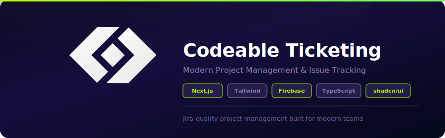

<p align="center">
  
</p>

<p align="center">
  
  
  
  
</p>

<p align="center">
  <strong>A modern, Jira-quality project management and issue tracking platform built for agile teams.</strong>
</p>

---

## Overview

Codeable Ticketing is a full-featured project management platform with real-time collaboration, rich text descriptions, workflow automation, and team management. Built with Next.js 14, deployed on Vercel.

### Key Features

- **Projects** — Create and manage projects with custom codes, member roles (admin/member), and linked resources
- **Issue Tracking** — Epics, stories, tasks, and bugs with priority levels, assignees, and estimated completion dates
- **Kanban Workflows** — Customizable workflow statuses (To Do, In Progress, In Review, RFQA, Done, etc.)
- **Rich Text Descriptions** — HTML-rendered ticket descriptions with tables, code blocks, and formatted content via Tiptap editor
- **Team Management** — Organize members into teams, assign roles, manage permissions
- **User Profiles** — Avatars, profile settings, activity tracking
- **Comments** — Threaded comments on issues with real-time updates
- **Analytics** — Project-level analytics and reporting

---

## Tech Stack

| Layer | Technology |
|-------|-----------|
| **Framework** | Next.js 14 (App Router) |
| **Language** | TypeScript |
| **Styling** | Tailwind CSS + shadcn/ui components |
| **Auth** | Firebase Authentication |
| **Rich Text** | Tiptap editor |
| **State** | React Context + SWR |
| **Deployment** | Vercel |

---

## Getting Started

### Prerequisites

- Node.js 18+
- Firebase project with Authentication enabled
- Codeable Ticketing API backend running

### Setup

```bash
git clone https://github.com/gocodeable/codeable-ticketing-frontend.git
cd codeable-ticketing-frontend
npm install
```

Create a `.env.local` file:

```env
NEXT_PUBLIC_FIREBASE_API_KEY=your-api-key
NEXT_PUBLIC_FIREBASE_AUTH_DOMAIN=your-project.firebaseapp.com
NEXT_PUBLIC_FIREBASE_PROJECT_ID=your-project-id
NEXT_PUBLIC_API_BASE_URL=https://your-api.com/api/v1
```

### Development

```bash
npm run dev
```

Open [http://localhost:3000](http://localhost:3000) to see it running.

### Build

```bash
npm run build
```

---

## Project Structure

```
app/
├── auth/               # Login, signup, password reset
├── projects/           # Project listing and dashboard
├── project/[code]/     # Single project view (issues, settings, members)
├── teams/              # Team listing
├── team/[id]/          # Team detail view
├── profile/            # User profile and settings
└── api/                # API routes

components/
├── IssueViewMode.tsx   # Issue detail with HTML description rendering
├── RichTextEditor.tsx  # Tiptap-based rich text editor
├── KanbanBoard.tsx     # Drag-and-drop kanban view
├── ProjectCard.tsx     # Project card component
└── ...                 # shadcn/ui components and custom UI
```

---

## AI Integration

This platform is designed to work with AI-powered automation:

- **[Codeable Ticketing MCP](https://github.com/gocodeable/codeable-ticketing-mcp)** — MCP server that lets Claude manage tickets directly through conversation
- **[Codeable Ticketing Skill](https://github.com/gocodeable/codeable-ticketing-skill)** — Claude skill that auto-generates detailed tickets from specs, PRDs, and codebases

Together, they enable a workflow where you hand Claude a spec document and get a full sprint board with properly formatted, assigned, and estimated tickets.

---

## Deployment

Deployed on Vercel. See [VERCEL_DEPLOYMENT_GUIDE.md](VERCEL_DEPLOYMENT_GUIDE.md) for configuration details.

---

## License

MIT

<p align="center">
  <br />
  <a href="https://gocodeable.com">
    <picture>
      <source media="(prefers-color-scheme: dark)" srcset="assets/codeable_wordmark_white.svg" />
      <source media="(prefers-color-scheme: light)" srcset="assets/codeable_wordmark.svg" />
      
    </picture>
  </a>
  <br />
  <sub>Built by <a href="https://gocodeable.com">Codeable</a></sub>
</p>
